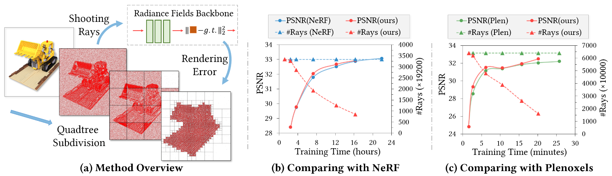
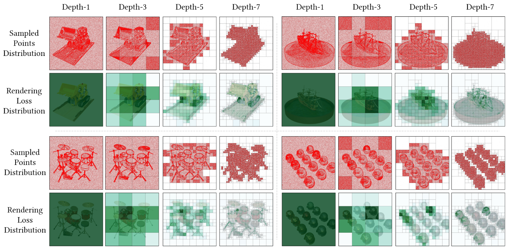
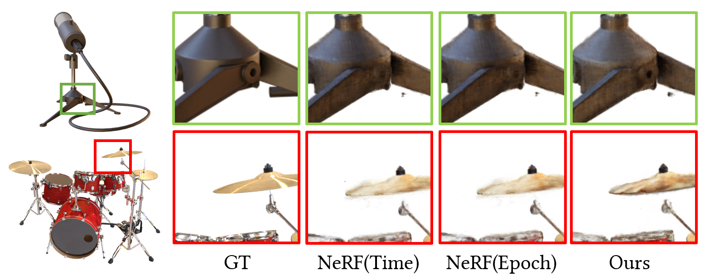
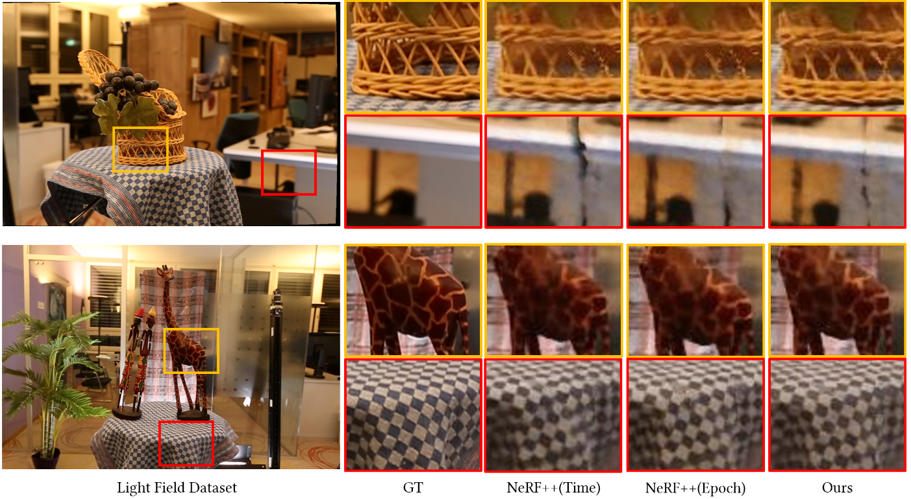
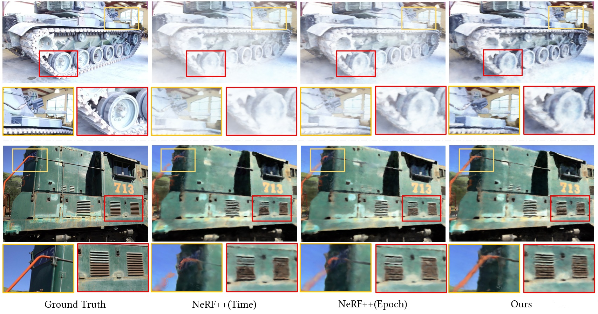

# Fast Learning Radiance Fields by Shooting Much Fewer Rays

 [Wenyuan Zhang](https://zparquet.github.io/)<sup>1</sup>,
 [Ruofan Xing](https://breezexrf.github.io/)<sup>1</sup>,
 [Yunfan Zeng](https://zengyf131.github.io/)<sup>1</sup>,
 [Yu-Shen Liu](https://yushen-liu.github.io/)<sup>1</sup>,
 [Kanle Shi]()<sup>2</sup>,
 [Zhizhong Han](https://h312h.github.io/)<sup>3</sup><br>

 <sup>1</sup>Tsinghua University, <sup>2</sup>Kuaishou Technology, <sup>3</sup>Wayne State University  

### [Project Page](https://zparquet.github.io/Fast-Learning/) |  [Paper](https://arxiv.org/pdf/2208.06821.pdf)
In this work, we introduce a general strategy to speed up the learning procedure for almost all radiance fields based methods by shooting much fewer rays. 
<br><br>




## Setup

Python 3 dependencies:

* Pytorch
* matplotlib
* numpy
* imageio
* configargparse


Specifically, our experiments are conducted on three radiance field based methods, including [**NeRF**](https://github.com/bmild/nerf), [**NeRF++**](https://github.com/Kai-46/nerfplusplus) and [**Plenoxels**](https://github.com/sxyu/svox2). We finetuned their official codes and apply our method to the baseline methods. To setup each individual environment for each experiment, please refer to the project pages of the baseline methods.

## Data preparation

We use four datasets named synthetic dataset, llff dataset, lf dataset and tanks_and_temples dataset, which are widely used in radiance fields based methods. You can download the four datasets from the following links.

### [Synthetic Dataset](https://drive.google.com/drive/folders/128yBriW1IG_3NJ5Rp7APSTZsJqdJdfc1) | [LF Dataset](https://drive.google.com/file/d/1gsjDjkbTh4GAR9fFqlIDZ__qR9NYTURQ/view?usp=sharing) | [LLFF Dataset](https://drive.google.com/drive/folders/128yBriW1IG_3NJ5Rp7APSTZsJqdJdfc1) | [Tanks And Temples Dataset](https://drive.google.com/file/d/11KRfN91W1AxAW6lOFs4EeYDbeoQZCi87/view?usp=sharing)
</br>


## Running code


### Running NeRF-based Method:

```
cd nerf-ours
```
Training
```
CUDA_VISIBLE_DEVICES=0 python run_nerf.py --config configs/lego.txt
```
Testing
```
CUDA_VISIBLE_DEVICES=0 python run_nerf.py --config configs/lego.txt --ft_path logs/paper_lego/011.tar --render_only --render_test
```


### Running NeRF++-based Method:


```
cd nerf++-ours
```
Training
```
CUDA_VISIBLE_DEVICES=0 python ddp_train_nerf.py --config configs/tanks_and_temples/tat_training_truck.txt
```
Testing
```
CUDA_VISIBLE_DEVICES=0 python ddp_test_nerf.py --config configs/tanks_and_temples/tat_training_truck.txt --render_splits test
```

### Running Plenoxels-based Method:

```
cd plenoxels-ours/opt
```

Training
```
CUDA_VISIBLE_DEVICES=0 python opt.py data/nerf_synthetic/lego -t ckpt/paper_lego -c configs/syn.json
```
Testing
```
CUDA_VISIBLE_DEVICES=0 python render_imgs.py ckpt/paper_lego/ckpt.npz data/nerf_synthetic/lego
```


## Some Visualization Results

### Visulization of Quadtree Subdivision Procedure



### Visualization of Comparison on Synthetic Dataset



### Visualization of Comparison on LF Dataset



### Visualization of Comparison on Tanks And Temples Dataset



## Citation

```
@article{zhang2022fast,
  title={Fast Learning Radiance Fields by Shooting Much Fewer Rays},
  author={Zhang, Wenyuan and Xing, Ruofan and Zeng, Yunfan and Liu, Yu-Shen and Shi, Kanle and Han, Zhizhong},
  journal={arXiv preprint arXiv:2208.06821},
  year={2022}
}
```